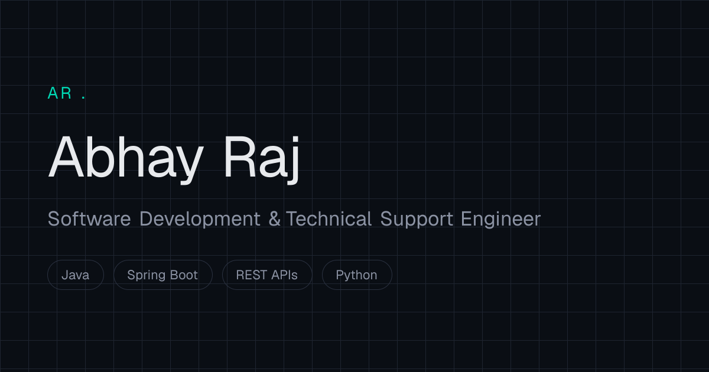

<div align="center">



# Abhay Raj — Portfolio

Software Development & Technical Engineer · MCA student building REST APIs with Java & Spring Boot, and analytics dashboards with Python.

[](https://abhayraj81.vercel.app/)
[](mailto:abhay.ark12@gmail.com)
[](https://linkedin.com/in/abhayraj081)
[](https://github.com/abhayraj81)

</div>

<br/>

## About

Personal portfolio site — vanilla HTML/CSS/JS, no framework or build step. Animated with **GSAP** + **ScrollTrigger**, smooth-scrolled with **Lenis**, styled around a dark, precision-engineering aesthetic.

Sections: About · Toolbox · Experience · Projects · Credentials · Contact (with downloadable résumé).

## Stack


Typography: Space Grotesk, IBM Plex Sans, JetBrains Mono (self-hosted).

## Structure

```
portfolio/
├── assets/          # Résumé, favicon, social preview image
├── css/             # base, navbar, hero, sections-1, sections-2
├── fonts/           # Self-hosted woff2 fonts
├── js/
│   ├── vendor/      # GSAP, ScrollTrigger, Lenis
│   ├── data.js      # Site content
│   └── main.js      # Animations & interactions
└── index.html
```

## Projects

| Project | Stack |
|---|---|
| **[HR Analytics Dashboard](https://hr-analysis-ark.streamlit.app/)** | Python, Pandas, NumPy, Streamlit, Plotly |
| **[Employee Management System APIs](https://github.com/abhayraj81/SpringBoot-MVC-and-RESTful-APIs)** | Java, Spring Boot, Spring Data JPA, Hibernate |
| **[Samarpan Sansthan — NGO Website](https://samarpansansthan.com/)** | HTML5, CSS3, JavaScript |

## Contact

[abhay.ark12@gmail.com](mailto:abhay.ark12@gmail.com) · [linkedin.com/in/abhayraj081](https://linkedin.com/in/abhayraj081) · [github.com/abhayraj81](https://github.com/abhayraj81)

<sub>© 2026 Abhay Raj — Built in Kanpur, India.</sub>
